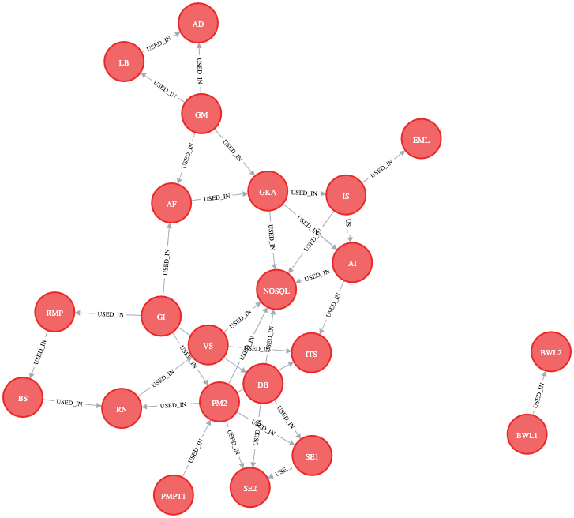
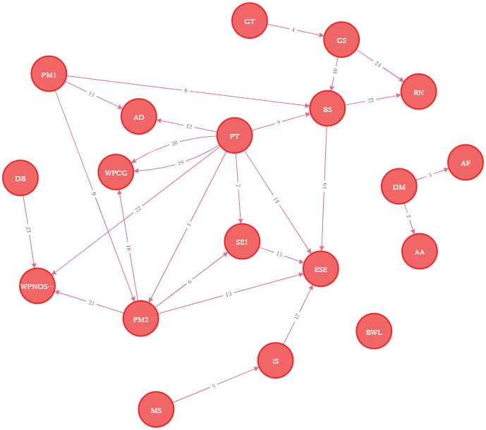

[TOC]
# NoSQL Praktikum - Alexander Könemann, Hugo Protsch

# NoSQl Termin/Blatt 2

## Aufgabe 4: PLZ-API Redis
Die Aufgabe wurde in Form einer REST-API gelöst.
Die Dokumentation dieser ist unter anderem mithilfe von Swagger auf Port `31474` (`http://localhost:31474/swagger`) vorzufinden.

Es existieren zwei Endpoints, welche im `ZipDataController` definiert sind:
1. `GET /city/{zipCode}` gibt die den Stadtnamen und Staat der Postleitzahl zurück.
2. `GET /zip/{cityName}` gibt eine Liste aller Postleitzahlen zurück, dessen Stadtname `cityName` entspricht.

In der Redis Datenbank werden dafür die folgenden Daten importiert:

1. Key: `{zip}.state` Value: Der Staat, in dem sich die Stadt mit der Postleitzahl `{zip}` befindet
2. Key: `{zip}.city` Value: Der Name der Stadt mit der Postleitzahl `{zip}`
3. Key: `{city}.zip` Value: Eine Liste aller Postleitzahlen mit dem Stadtnamen `{city}`

## Aufgabe 5: Absolvierte Module
1. Start Neo4j (graph db):
```bash
docker run \
    --name our-neo4j \
    -p7474:7474 -p7687:7687 \
    --env NEO4J_AUTH=neo4j/test \
    neo4j:latest
```
Browser runs on localhost:7474
```
username: neo4j pw: test
```
2. Run script of `ModulesAlexander.cypher` / `ModulesHugo.cypher` file in Neo4j browser Interface

### Output Graph Alexander



### Output Graph Hugo



- Aufgabe 5b 1.): Welche Module sind für NoSQL/BigData nützlich?
```cypher
MATCH (c1:Course)-[:USED_IN]->(c2:Course) WHERE c2.name = "NOSQL" RETURN DISTINCT c1.name
```
- Aufgabe 5b 2.): Welche Module wurden bisher im Studium nicht wieder genutzt? 
Anders formuliert: Welche Knoten haben keinen Nachfolgeknoten?
```cypher
MATCH (c1:Course) WHERE NOT exists((c1)-[:USED_IN]->()) RETURN DISTINCT c1.name`
```

## Aufgabe 6 Conceptnet
1. Open bash on container and remove folders in data folder:
```bash
docker exec -it our-neo4j  /bin/bash
```
2. Import of data via docker cp command:
```bash
docker cp /Users/alexander.koenemann/IdeaProjects/NoSQLWP/nosqlHugoAlex/Aufgabe6-graph-db/neo4j-v4-data/. our-neo4j:data/
```
3. Query:
```cypher
MATCH (n {id : "/c/en/baseball"})-[r:IsA]-(result) RETURN result.id
````

# Termin/Blatt 3
## Aufgabe 7: Mongo DB API
Für die Aufgabe wird weiterhin die REST-API aus dem vorherigen Aufgabenblatt verwendet.
In den `appsettings.json` wurde ein zusätzlicher Key `Db` eingeführt, über den zwischen `Redis`, `MongoDB` und zukünftig 
`Cassandra` gewählt werden kann.

### Architekur

Der REST-API Controller `PlzDataController` erhält über Dependency-Injection einen `ICityService` übergeben.
Dieses Interface stellt zwei Methoden bereit:
1. `City? GetCityFromZip(string zip);`
2. `IEnumerable<string> GetZipsFromCity(string city);`

Dieses Interface wird jeweils einmal pro Datenbank implementiert.
So gibt es aktuel einen `MongoCityService` und einen `RedisCityService`.
Einer dieser Implementationen (wie in `appsettings.json` spezifiziert) wird beim Initialisieren der
Anwendung in der Klasse `Startup` in den Konstruktor des Controllers injiziert.

Des weitern wurde Unterstützung für docker compose  hinzugefügt, welche es erlauben alle benötigten Docker
Container in einer Datei zu konfigurieren und diese anschließend mit einem Befehl zu starten.
- `docker-compose-local-dev.yml` startet die services im docker container und mapped die jeweiligen Ports zum Host,
  sodass die API auf vom Host auf die Container zugreifen kann.
- `docker-compose.yml` baut die Api mithilfe einer Dockerfile und startet diese in einem Container.
  Die benötigten Services werden ebenfalls in als Container gestartet, die Ports werden aber nur innerhalb des Netzwerks exposed,
  anstatt diese zum Host zu mappen. Der Port 8000 wird zum Host gemappt, somit kann die API über diesen erreicht werden. 
  Aktuell wird Swagger in der Variante nicht unterstützt 

### MongoDB Desgin

In der MongoDB wird pro Datensatz ein Dokument angelegt, welches die folgenden Felder enthält:
- `Id` (Von Mongo generiert)
- `Name` (Name der Stadt)
- `State` (Der Staat in dem sich die Stadt befindet)
- `Zip` (Der Zip-Code der Stadt)

### Vorbereitung

- Starten der container:
  - Variante 1: API in Container
    1. `docker-compose up` baut und startet die API; startet die Mongo, Redis und Cassandra DB Container.
    - DB Abfrage über curl
      1. get city and state: 'curl http://localhost:8000/city/01001'
      2. get zip: 'curl http://localhost:8000/zip/Hamburg'
  - Variante 2: API auf Host
    1. `docker-compose -f docker-compose-local-dev.yml up` startet die Mongo, Redis und Cassandra DB Container. 
    2. Bauen und starten von `Api`
    - Swagger über 'http://localhost:5000/swagger/index.html' aufrufen

### Benchmark
Als Benchmark wird eine Folge von blockierenden Datenbank abfragen verwendet.
1. Zips von den folgenden Städten
   - `HAMBURG`, `EAST LIVERMORE`, `PINEHURST`, `JEFFERSON`
2. Stadtnamen der folgenden Zips
   - `55339` , `76384`, `83455`, `93644`

Zum ausführen der Benchmark `docker-compose -f docker-compose-local-dev.yml up` ausführen, anschließen `Benchmark` bauen und starten.

#### Ergebnisse
Testsystem: DDR4 RAM, NVMe SSD

|     Method |      Mean |     Error |    StdDev |
|----------- |----------:|----------:|----------:|
| BenchRedis |  6.060 ms | 0.0422 ms | 0.0352 ms |
| BenchMongo | 86.632 ms | 1.3951 ms | 1.2367 ms |

### Vergleich LoC, Arbeitszeit:

Entwicklung mit Redis: 
- Aufwendiger als Mongo DB. Es wurden 95 LoC benötigt, der Unterschied resultiert aus dem aufwendigeren Datenmodell. Die gegebenen Daten konnten nicht in einem Dokument gespeichert werden, sondern mussten jeweils mit verschiedenen key/value Kombinationen angelegt und abgefragt werden.  

Entwicklung mit Mongo: 
- Weniger aufwendig als Redis DB: Es wurden 79 LoC benötigt. Das JSON Format und die Möglichkeit alle Daten in einem Dokument zu speichern verinfachten sowohl das Speichern als auch das Abfragen der Daten. 

## Aufgabe 8: Sinn des Lebens
### Vorbereitung
- Starten der shell:
   - `docker exec -it {container name} bash`
   - `mongo`
- Löschen der Daten: 
  - `db.getCollection("fussball").drop()`
- Zählen der Daten:
  - `db.getCollection("fussball").find().count()`

a) Einfügen der Daten
```javascript
db.fussball.insertMany([
    {name: 'HSV', gruendung: new Date(1888, 09, 29), farben: ['weiss', 'rot'], Tabellenplatz: 17, nike: 'n'},
    {name: 'Dortmund', gruendung: new Date(1909, 12, 19), farben: ['gelb', 'schwarz'], Tabellenplatz: 16, nike: 'n'},
    {name: 'Schalke', gruendung: new Date(1904, 5, 4), farben: ['blau'], Tabellenplatz: 15, nike: 'n'},
    {name: 'Paderborn', gruendung: new Date(1907, 8, 14), farben:['blau', 'weiss', ], Tabellenplatz:14, nike:'n', },
    {name: 'Hertha', gruendung: new Date(1892, 7, 25), farben: ['blau', 'weiss'], Tabellenplatz: 13, nike: 'j'},
    {name: 'Augsburg', gruendung: new Date(1907, 8, 8), farben: ['rot', 'weiss'], Tabellenplatz: 12,  nike: 'j'},
    {name: 'Pauli', gruendung: new Date(1910, 5, 15), farben: ['braun', 'weiss'], Tabellenplatz: 11, nike: 'n'},
    {name: 'Gladbach', gruendung: new Date(1900, 8,1), farben: ['schwarz', 'weiss', 'gruen'], Tabellenplatz: 10, nike: 'n'},
    {name: 'Frankfurt', gruendung: new Date(1899, 3, 8), farben: ['rot', 'schwarz', 'weiss'], Tabellenplatz: 9, nike: 'j'},
    {name: 'Leverkusen', gruendung: new Date(1904, 11, 20, 16, 15), farben: ['rot', 'schwarz'], Tabellenplatz: 8, nike: 'n'},
    {name: 'Stuttgart', gruendung: new Date(1893, 9, 9 ), farben: ['rot', 'weiss'], Tabellenplatz: 7, nike: 'n'},
    {name: 'Werder', gruendung: new Date(1899,2,4), farben: ['gruen','weiss'], Tabellenplatz: 6, nike: 'j'}
]);
```
### Find Abfragen
1. alle Vereine, mit Namen "Augsburg"
```javascript
db.getCollection("fussball").find({ "name" : "Augsburg" })
```
2. alle Nike-Vereine, welche schwarz als mindestens eine Vereinsfarbe haben
```javascript
db.getCollection("fussball").find({ "nike" : "j", "farben" : { $all : [ "schwarz" ] } })
```
3. alle Nike-Vereine, welche weiss und grün als Vereinsfarbe haben
```javascript
db.getCollection("fussball").find({ "nike" : "j", "farben" : { $all : [ "weiss", "gruen" ] } })
```
4. alle Nike-Vereine, welche weiss oder grün als Vereinsfarbe haben
```javascript
 db.getCollection("fussball").find( 
     { "nike" : "j",
         $or : [
             { "farben" : { $all : [ "gruen" ] } },
             { "farben" : { $all : [ "weiss" ] } } 
         ] 
     } 
 );
```
5. den Verein mit dem höchsten Tabellenplatz
```javascript
db.getCollection("fussball").find().sort({ Tabellenplatz : 1 }).limit(1)
```
6. alle Vereine, die nicht auf einem Abstiegsplatz stehen
```javascript
db.getCollection("fussball").find({ Tabellenplatz : { $lt : 15 } })
```
7. Erstellen Sie eine beliebige andere sinnvolle Abfrage und unterdrücken Sie dabei die Ausgabe des \_id Feldes
```javascript
db.getCollection("fussball").find({ gruendung : { $gt : new Date(1900, 1, 1) } }, { _id : 0 })
```

### Update Abfragen
Führen sie folgende Änderungsoperation aus:
```javascript
db.fussball.update({ name : 'Augsburg' }, { Tabellenplatz : 1 })
```
Was beobachten sie als Ergebnis?
  - `{ "_id" : ObjectId("618bfaafa0817d590df179df"), "Tabellenplatz" : 1 }`
  Das komplette Objekt wird durch das übergebene (`"Tabellenplatz" : 1`) ersetzt. Die id bleibt jedoch gleich.

1. Ändern sie den Tabellenplatz von Leverkusen auf 2
```javascript
db.fussball.update({ name : "Leverkusen" }, { $set : { Tabellenplatz : 2 } })
```
2. Werder soll um einen Tabellenplatz nach vorne gebracht werden
```javascript
db.fussball.update({ name : "Leverkusen" }, { $inc : { Tabellenplatz : - 1 } })
```
3. Ergänzen sie für den HSV ein Attribut „abgestiegen“ mit einem sinnvollen Wert
```javascript
db.fussball.update({ name : "HSV" }, { $set : { "abgestiegen" : 1 } })
```
4. Ergänzen sie für alle Vereine, deren Vereinsfarbe weiss enthält, ein Attribut "Waschtemperatur" mit dem Wert 90.
```javascript
db.fussball.update({ "farben" : { $all : ["weiss"] } }, { $set : { "Waschtemperatur" : 90 } }, { multi : true } )
```
## Aufgabe 9: Installieren Wide-Column-Database
- Starten der shell:
  - `docker compose up` startet die Mongo, Redis und Cassandra DB container.

## Aufgabe 11:
Grundlage: Klonen eiens Repositories für das Erstellen des Hadoop Containers:
```
git clone https://github.com/big-data-europe/docker-hadoop.git
```
Starten des Docker Containers:
```
docker-compose up
```
### Testen der Hadoop Umgebung mit einem MapReduce Job auf Basis eines Beispielprogramms für Map Reduce:
- Quelle der .jar Datei: https://repo1.maven.org/maven2/org/apache/hadoop/hadoop-mapreduce-examples/2.7.1/hadoop-mapreduce-examples-2.7.1-sources.jar
- Kopieren der .jar Datei in die Namenode des Containers (Die .jar liegt im Aufgabenordner unseres Repos):
  ```
  docker cp hadoop-mapreduce-examples-2.7.1-sources.jar namenode:/tmp/
  ```
### Erstellen einer WordCount Beispieldatei und Einfügen im Docker Container:
- Als Textinput wird der erste Band von Harry Potter verwendet: ``harryPotter_wordcount_example.txt``
- Kopieren der Datei in die Namenode des Containers (Die Quelldatei liegt im Aufgabenordner unseres Repos):
  ```
  docker cp harryPotter_wordcount_example.txt namenode:/tmp/
  ```
- Die Datei ist jetzt für den Container sichtbar und kann über ein Terminal in den entsprechenden Zielordner kopiert werden:
- Shell auf der namenode öffnen:
   ```
  docker exec -it namenode /bin/bash
  ```
- Erstellen eines Inputfolders im HDFS Dateisystem (-p steht für parent folder with children):
  ```
  hdfs dfs -mkdir -p /user/root/input
  ```
- Verschieben des Textdokumentes in der HDFS Input Ordner:
  ```
  hdfs dfs -put tmp/harryPotter_wordcount_example.txt /user/root/input
  ```
### Ausführung des Map-Reduce_Jobs zum Testen der Hadoop Umgebung:
- Parameter: Class: (<...>.jar), Funktion: WordCount, Input, Output
```
hadoop jar hadoop-mapreduce-examples-2.7.1-sources.jar org.apache.hadoop.examples.WordCount input output
```
Anzeige der Outputdateien und Ergebnis:
```
hdfs dfs -ls /user/root/output
```
```
-rw-r--r--   3 root supergroup          0 2021-11-28 11:15 /user/root/output/_SUCCESS
-rw-r--r--   3 root supergroup     121427 2021-11-28 11:15 /user/root/output/part-r-00000
```
Ergebnisdatei ausgeben:
```
hdfs dfs -cat /user/root/output/part-r-00000
```
Ergebnisdatei in lokales Dateisystem kopieren
```
hdfs dfs –copyToLocal /user/root/output/part-r-00000 /tmp
```
``` 
docker cp namenode:/tmp/part-r-00000 /Users/alexander.koenemann/IdeaProjects/NoSQLWP/nosqlHugoAlex/Aufgabe-11-MapReduce/
```
Ergebnisdatei mit Python Script auswerte, um TOP 10 Wörter aus dem ersten Band anzuzeigen:
``` 
python3 findMaxInWordcountOutput.py
```
Ergebnis der TOP 10 Wörter aus Harry Potter 1:
``` 
the: 3654
and: 2139
to: 1827
a: 1578
Harry: 1254
of: 1233
was: 1150
he: 1020
in: 898
his: 892
```