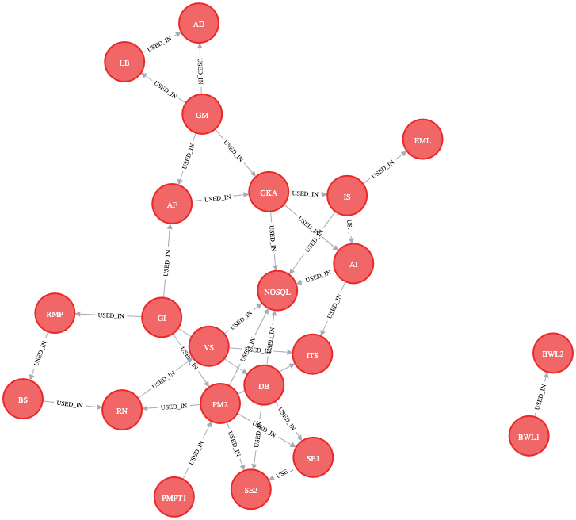

# nosql

# Aufgabe 4:
## Start Redis Docker image:
    docker run --rm -d -p 6379:6379  --name plz-redis-db redis
- flag -rm: volumes will be deleted after exit 
- flag -d: container process is detached (background process)
- flag -p: Expose port 6379 from docker-process to local port 6379


 Insert .plz data into Redis DB with python script in project folder:
    ``
    python3 fill_redis_db_with_plz_data.py
    ``

## Start Client Application to access DB:

## Start Redis CLI:
    docker exec -it plz-redis-db redis-cli

## Stop docker cointainers:
    docker stop <Hash of Process>

# Aufgabe 5:
# 1. Start Neo4j (graph db):

```
docker run \
    --name our-neo4j \
    -p7474:7474 -p7687:7687 \
    --env NEO4J_AUTH=neo4j/test \
    neo4j:latest
```

Browser runs on localhost:7474

```
username: neo4j pw: test
```

# 2. Run script of cypher_code.cypher file in Neo4j browser Interface
Output Graph:


// Aufgabe 5b 1.): Welche Module sind für NoSQL/BigData nützlich?

`MATCH (c1:Course)-[:USED_IN]->(c2:Course) WHERE c2.name = "NOSQL" RETURN DISTINCT c1.name`

// Aufgabe 5b 2.): Welche Module wurden bisher im Studium nicht wieder genutzt? 
Anders formuliert: Welche Knoten haben keinen Nachfolgeknoten?

`MATCH (c1:Course) WHERE NOT exists((c1)-[:USED_IN]->()) RETURN DISTINCT c1.name`

# Aufgabe 6:
## Open bash on container and remove folders in data folder:
```
docker exec -it our-neo4j  /bin/bash
```
## Import of data via docker cp command:
```
docker cp /Users/alexander.koenemann/IdeaProjects/NoSQLWP/nosqlHugoAlex/Aufgabe6-graph-db/neo4j-v4-data/. our-neo4j:data/
```

Query:
```
MATCH (n {id: "/c/en/baseball"})-[r:IsA]-(result) RETURN result.id
````