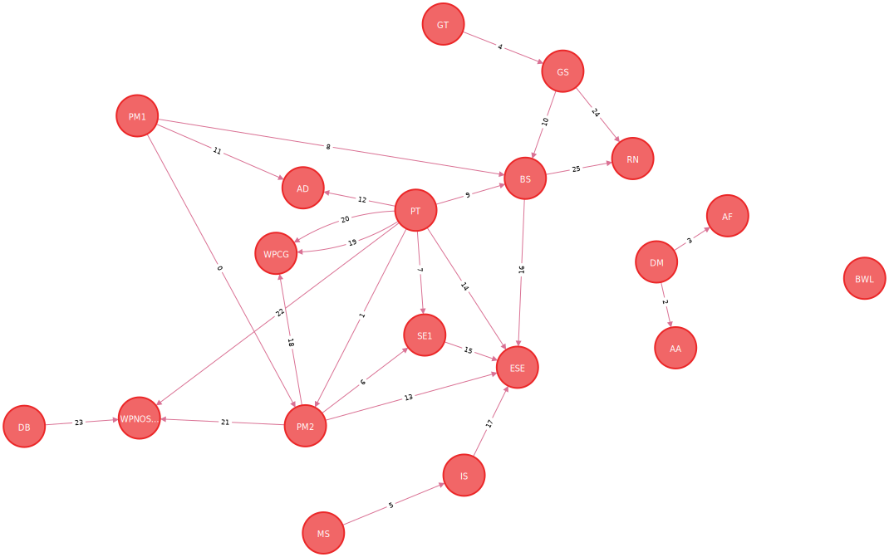

# nosql

## Aufgabe 4
Die Aufgabe wurde in Form einer REST-API gelöst.
Die Dokumentation dieser ist unter anderem mithilfe von Swagger auf Port `31474` (`http://localhost:31474/swagger`) vorzufinden.

Es existieren zwei Endpoints, welche im `ZipDataController` definiert sind:
1. `GET /city/{zipCode}` gibt die den Stadtnamen und Staat der Postleitzahl zurück.
2. `GET /zip/{cityName}` gibt eine Liste aller Postleitzahlen zurück, dessen Stadtname `cityName` entspricht.

In der Redis Datenbank werden dafür die folgenden Daten importiert:

1. Key: `{zip}.state` Value: Der Staat, in dem sich die Stadt mit der Postleitzahl `{zip}` befindet
2. Key: `{zip}.city` Value: Der Name der Stadt mit der Postleitzahl `{zip}`
3. Key: `{city}.zip` Value: Eine Liste aller Postleitzahlen mit dem Stadtnamen `{city}`

# Aufgabe 5:
# 1. Start Neo4j (graph db):

```
docker run \
    --name our-neo4j \
    -p7474:7474 -p7687:7687 \
    --env NEO4J_AUTH=neo4j/test \
    neo4j:latest
```

Browser runs on localhost:7474

```
username: neo4j pw: test
```

# 2. Run script of `ModulesAlexander.cypher` / `ModulesHugo.cypher` file in Neo4j browser Interface
Output Graph Alexander:


Output Graph Hugo:



// Aufgabe 5b 1.): Welche Module sind für NoSQL/BigData nützlich?

`MATCH (c1:Course)-[:USED_IN]->(c2:Course) WHERE c2.name = "NOSQL" RETURN DISTINCT c1.name`

// Aufgabe 5b 2.): Welche Module wurden bisher im Studium nicht wieder genutzt? 
Anders formuliert: Welche Knoten haben keinen Nachfolgeknoten?

`MATCH (c1:Course) WHERE NOT exists((c1)-[:USED_IN]->()) RETURN DISTINCT c1.name`

# Aufgabe 6:
## Open bash on container and remove folders in data folder:
```
docker exec -it our-neo4j  /bin/bash
```
## Import of data via docker cp command:
```
docker cp /Users/alexander.koenemann/IdeaProjects/NoSQLWP/nosqlHugoAlex/Aufgabe6-graph-db/neo4j-v4-data/. our-neo4j:data/
```

Query:
```
MATCH (n {id: "/c/en/baseball"})-[r:IsA]-(result) RETURN result.id
````
